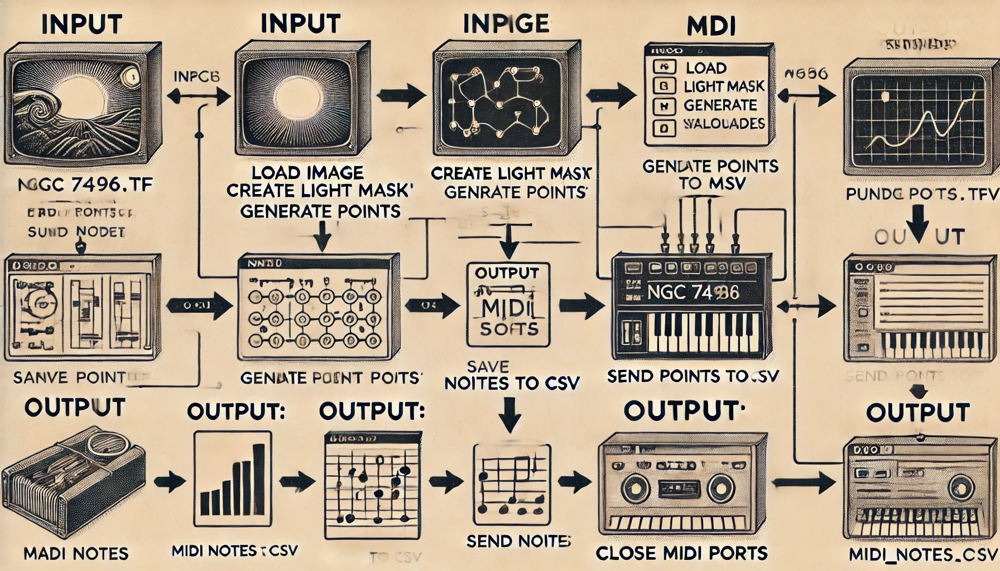

# Project: WebbSounds

<p align="center">  </p>

This project, developed by members of the astronomy research group during the NASA Space Apps 2024 event, aims to convert astronomical image data into musical notes. By utilizing image processing techniques and spectral analysis, sampled points from images are generated, and wavelengths are transformed into MIDI notes, which are sent through MIDI ports for playback.

## Project Members

Gonzalez-Ramirez, Lina Alejandra.  
Cardona-Grisales, Juan Steven.  
Pino-Roman, Daniel.  
Gómez-Olarte, Ramón Andrés.  
Moreno-Galeano, Froilan Esteban.  
Zuñiga-Ballesteros, Liz Andrea. 


## Required Librarie

To run this code, you need to install the following libraries in Python:

```bash
pip install numpy opencv-python pandas mido keyboard
```

Additionally, you need to install loopMIDI and REAPER as supplementary software.

  loopMIDI: A virtual MIDI port driver that allows you to create virtual MIDI ports to send and receive MIDI data between applications.  
  link: [loopMIDI Download](https://www.tobias-erichsen.de/software/loopmidi.html)

  REAPER: A digital audio workstation (DAW) that supports MIDI playback and recording. It is essential for processing the MIDI notes generated by the project.  
  link: [REAPER Download](https://www.reaper.fm/)

## Code Usage

<p align="center">  </p>


Prepare the Environment:

Ensure that the required libraries are installed.
File Structure:

Place the image file (e.g., NGC 7496.tif) in the Images directory.
Run the Main Code:

The main code, named musicFromUniverse.py, manages the execution flow. Ensure that the directory structure is as follows:

```bash
/project_directory
├── /scripts
│   ├── a_ImageProcessor.py
│   ├── b_WavelengthToMIDIConverter.py
│   └── c_MIDIPortHandler.py
├── /Images
│   └── NGC 7496.tif
└── musicFromUniverse.py
```

## Configure Parameters:

Edit the variables in musicFromUniverse.py as needed:

  image_path: Path to the image.
  num_points: Number of points to sample.
  outputImage_csv: Name of the CSV file to save the points.
  outputMIDI_csv: Name of the CSV file to save the MIDI notes.
  threshold: Threshold for the light mask.

## Run the Program:

Run the musicFromUniverse.py file in your terminal:

```bash
python musicFromUniverse.py
```

MIDI Interaction:

MIDI notes will be automatically sent through the configured MIDI ports. You can stop execution by pressing the Esc key.
Possible Errors and Solutions

Error: "ModuleNotFoundError"

Description: One of the required libraries is not installed.
Solution: Ensure all libraries are installed by running:

```bash
pip install numpy opencv-python pandas mido keyboard
```
## Errors and solutions

*Error: "FileNotFoundError"*

Description: The image or CSV file is not found at the specified path.
Solution: Verify that the path of the image file and the names of the CSV files are correct.

*Error: "MIDI port not found"*

Description: The specified MIDI ports are unavailable.
Solution: Ensure that the MIDI ports are correctly configured and that MIDI software (such as loopMIDI) is running.

*Error: "Keyboard interrupt"*

Description: The program stops unexpectedly.
Solution: Ensure that MIDI messages are not being sent to a device that cannot receive them, or press Esc to stop the execution in a controlled manner.
